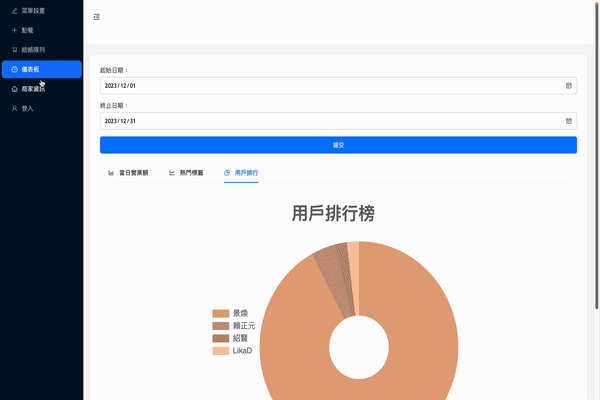

# iSEECRM 1.0.0

iSEECRM is a Customer Relationship Management (CRM) system tailored for store owners, designed to streamline business management processes, and offers an efficient and user-friendly experience
for both businesses and their customers.

<p align="center">
    
</p>

## Introduction

This system simplifies backend operations with features like customizable menu, ordering service, checkout systems, and detailed sales analytics.

Additionally, iSEECRM integrates a Line login system, eliminating the need for users to install separate applications. Patrons can effortlessly access their accounts with a one-click sign-in via the official Line profile, where they can review their dining activity and accumulate points.

The functionality not only enhances user engagement but also aids enterprises in compiling essential customer data, fostering an extensive network for marketing insights. Such a comprehensive approach promises both businesses and their clientele a more expedient and user-friendly experience.

## SKILLS

<div style="display: flex; flex-direction: row;">


 


</div>

## Demo

<p align="center">

<h1 style="color: red"> For Store Owner </h1>


<div style="margin: 10px; width: 600px;">

> This is the homepage for iSEECRM shop owners. It showcases the businesses that have partnered
> with the iSEECRM system, providing a clear overview of all the current collaborators right on the
> homepage.

</div>


<div style="margin: 10px; width: 600px;">

> Upon logging in, shop owners access their own backend system. After confirming their partnership
> with iSEECRM, they receive a unique set of credentials. With these credentials, they can log in
> and customize their menu, tags, and other features.

</div>

### Credentials for accessing the test environment

```sh
account: admin02
password: 123
```


<div style="margin: 10px; width: 600px;">

> Once inside, merchants can create their own menu items. These will be displayed at the top for
> easy editing. They can also use customization features like categories and tags to organize their
> menu. The dashboard allows them to view related data and, ultimately, export a customized menu
> for diners to view and order from.

</div>


<div style="margin: 10px; width: 600px;">

> In the ordering section, customers can either order themselves or get help from the restaurant
> staff. The menu items, sorted by category, are available for customers to choose from. After
> adding items to the cart and entering their table number, the order is sent directly to the front
> desk POS system.

</div>


<div style="margin: 10px; width: 600px;">

> The shop's POS system uses Socket.IO to notify updates in the checkout queue, ensuring the latest
> payment information is available. At checkout, the shop owner scans the member QR Code generated
> in the member card system to record the transaction and accumulate points for the customer.
> Finally, customers can choose to pay electronically through a Line Pay-integrated feature. Once
> the payment is complete, the order is removed from the checkout queue and stored in the database.

</div>

```sh
You can use sandbox simulator below to get LINE Pay checkout one-time key
and use "658e54c8c050de8360213328" as user number
```

### <a href="https://sandbox-web-pay.line.me/web/sandbox/payment/oneTimeKey?countryCode=TW&paymentMethod=card&fbclid=IwAR0JzqkGSaY3xRWkiSnf7g_u3Z-KxakcM2UZ5jPanfoPMjoVrGkBsocYjFA&preset=3">> sandbox one-time key</a>



<div style="margin: 10px; width: 600px;">

> Shop owners can instantly update their business information in the shop info section. This allows
> customers to access up-to-date Google reviews and other details about the shop through their
> membership cards.

</div>


<div style="margin: 10px; width: 600px;">

> Dashboard provides shop owners with business-related charts. They can select specific times to
> view sales data, find out the best-selling items based on tags, and see who are their most
> frequent customers.

</div>

<h1 style="color: red"> For Users </h1>

<p align="center">

</p>

<div style="margin: 10px; width: 600px;">

> For customers, the first step is to add iSEECRM as a Line official friend to establish a
> connection.

</div>

<p align="center">

</p>

<div style="margin: 10px; width: 600px;">

> By establishing a friendship with the official BOT, they can bind their member card to all
> associated stores, eliminating the need for additional applications.

</div>

<p align="center">

</p>

<div style="margin: 10px; width: 600px;">

> After adding the official account, they can access their member card information from the Info
> section and open the member card connection with the iSEECRM membership system.

</div>

<p align="center">

</p>

<div style="margin: 10px; width: 600px;">

> Only the first-time login requires permission; afterwards, accessing the member card system will
> automatically log them in, saving time and effort.

</div>

<p align="center">

</p>

<div style="margin: 10px; width: 600px;">

> Once logged in, customers are directed to the iSEECRM member page, where they can view their QR
> Code member ID and browse all partner stores. Clicking on a store's membership card redirects
> them to that particular store, allowing them to view their accumulated points, dining history,
> and Google reviews of the store.

</div>

<p align="center">

</p>

<div style="margin: 10px; width: 600px;">

> For users interested in trying out the membership card feature without having to use their
> personal profile, there's an test environment for you, they can select '測試登入'
> to enter the testing environment. Please note that in the testing
> environment, if you want to navigate to other stores, it must be done through the '店家會員卡' button within the test environment. To experience the actual redirection from .
> the User Card to different stores, please log in using Line.

```sh
Test Environment Credentials:

UID: 658e54c8c050de8360213328
Name: John Doe
```

</div>

</div>

## Architecture

<p style="display: flex; flex-direction: column; justify-content: center; align-items: center;">


- Directed requests through a Load Balancer to EC2 Instances, which then reverse proxy to the Node.js Application server, effectively distributing user traffic to reduce server load.

- Configured the system to access distinct databases in the MongoDB Atlas Cluster for each store, ensuring data isolation and enhanced security in a multi-tenant database environment.

- Stored static files in AWS S3 Bucket and use CloudFront for caching to speed up webpage and images loading.

- Utilized Socket.IO in the Application Server for low-latency and bidirectional communication, enabling shop owners to instantly update and view the most current checkout queue results.

- Integrated the Line login API in iSEECRM to simplify user access, enabling users to sign in with one click

- Based on specific merchants, the backend fetches Place API from Google Server to obtain Google comments for the merchants.

</p>

## Authors

- [@huanciou](https://www.github.com/huanciou)
